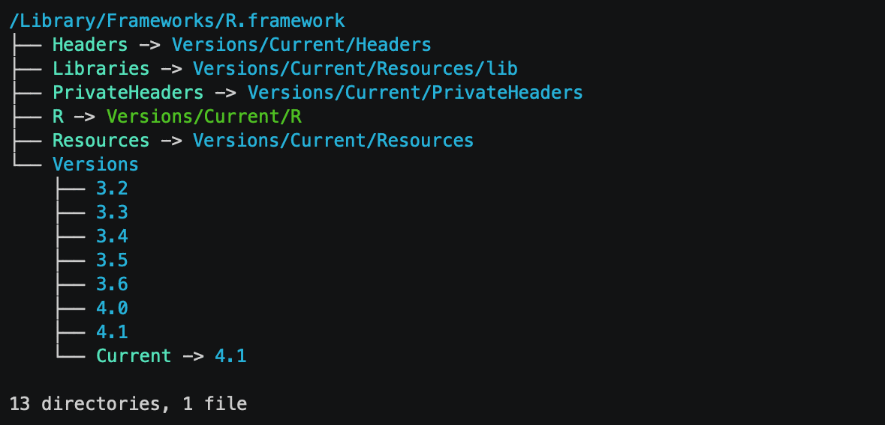
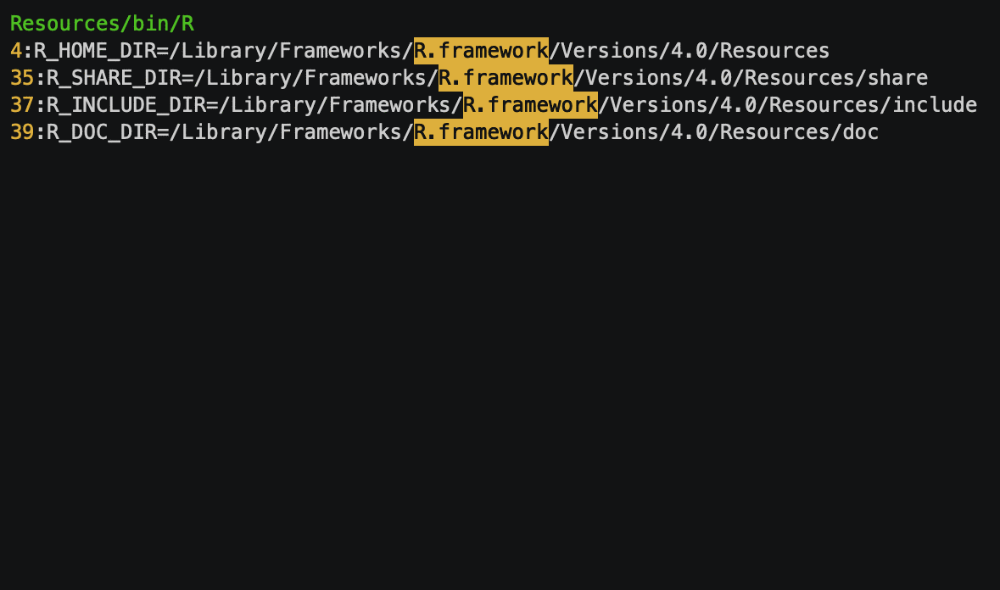
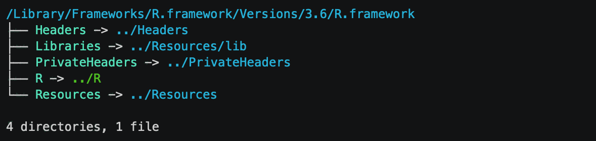

<!-- -*- mode: gfm; canonical: true -*- -->

TL;DR
-----

If you need to use multiple versions of R on macOS, look at the `install-rstats` package in the 'Installer' section below.

Introduction
------------

As an R package developer, it is mostly your choice which R versions you support. If your package is on CRAN, then you must support the latest R release and also fix issues that come up when your package is tested on the current development version (R-devel). These two versions are the minimum, but developers typically try to do better. E.g. the tidyverse supports the [four previous versions or R](https://www.tidyverse.org/blog/2019/04/r-version-support/).

The more versions you support, the more versions you typically keep on your development machine, to be able to reproduce problems and fix bugs, that are specific to older or newer versions. [R-hub is great](https://blog.r-hub.io/2019/03/26/why-care/) for quick checks, but if there is a problem, you'll want to run R on your local machine to investigate. In this post we show a way to run multiple R versions on macOS, at the same time.

The macOS R installer
---------------------

The official CRAN R installers work differently on different operating systems. On Windows, every R version is installed into its own directory and works independently of the others. On Linux, distributions typically only support one R version at any time, but you can easily use Docker to run [multiple R versions](https://github.com/r-hub/r-minimal#readme).

macOS is a bit more difficult. You can install [multiple (minor) R versions](https://cran.r-project.org/doc/manuals/R-admin.html#Multiple-versions), but by default you cannot use them independently.

The macOS R installer creates a [macOS framework](https://developer.apple.com/library/archive/documentation/MacOSX/Conceptual/BPFrameworks/Frameworks.html) in `/Library/Frameworks/R.framework`. By default it removes the already installed version, so this directory only contains one version of the framework. To keep the previous version, you need to "forget" (`pkgutil --forget`) all Apple packages that the installer creates. See the [admin manual](https://cran.r-project.org/doc/manuals/R-admin.html#Multiple-versions). This way you can install multiple R versions, as long as they are different minor versions. I.e. you can install R 3.6.3 and R 4.0.0 together, but not R 3.6.2 and R 3.6.3. After installing a couple of R versions, `/Library/Frameworks/R.framework` may look like this:

``` bash
$ tree -n -L 2 /Library/Frameworks/R.framework
```



The various R versions are kept in separate directories, named according to their minor version numbers: `3.2`, `3.3`, etc. `Current` is a symbolic link to the currently *active* version. This is by default the version that was installed last. To activate a different version, you can update the symbolic link to point to the directory of the desired version. However, only do this if you are not running any computations using the currently active R version, because that might crash.

[RSwitch](https://rud.is/rswitch/) is a handy tool that helps you with the version switch. It sits on the menu bar, you can use it to select the desired R version, and then it will update he symbolic link accordingly.

Problems and workarounds
------------------------

It would be great to be able to run multiple R versions at the same time. Then you could kick off an `R CMD check` using R-devel, without having to interrupt your currently running sessions. The R Admin manual claims that [this is possible](https://cran.r-project.org/doc/manuals/R-admin.html#Multiple-versions) by starting the version specific R executable directly, but [unfortunately it is not](https://bugs.r-project.org/bugzilla/show_bug.cgi?id=17257).

The problem is that some R scripts and configuration files refer to the active version, throught the `Current` symbolic link, instead of the version specific files and directories:

``` bash
$ cd /Library/Frameworks/R.framework/Versions/4.0
$ ag --ignore '*.html' --ignore 'NEWS*' 'R\.framework'
```



Fixing these is mostly straightforward. We need to replace every reference to `.../R.framework/Resources/...` with `.../R.framework/Versions/<version>/Resources/...`. (`<version>` is the minor version, e.g. `3.6`).

The `Makeconf` entry is a bit trickier. This specifies the `/Library/Frameworks` directory (effectively) for the compiler to look for frameworks and the compiler will always find the default (`Current`) framework. To fix this, we need to create a dummy framework within the `Versions/<version>` directory, using symbolic links. It looks like this for R 3.6:

``` bash
$ tree /Library/Frameworks/R.framework/Versions/3.6/R.framework
```



Then we can tell the compiler to look for frameworks in (e.g.) `/Library/Frameworks/R.framework/Versions/3.6`.

Once all the listed references are updated, and the dummy framework symbolic links are in place, you can call `/Library/Frameworks/R.framework/Versions/3.6/Resources/bin/R` directly, to start R 3.6.x, without changing the `Current` link or affecting the already running R versions.

Installer
---------

The several steps discussed above can be quite tedious, so we automated them in a shell script, and a Node.js package that can install several R versions with a single command. (The reason for Node.js is that we use it on GitHub Actions, which currently supports writing actions in Node.js.)

You can install the [`install-rstats` npm package](https://www.npmjs.com/package/install-rstats) to get the installer:

``` sh
$ npm install -g install-rstats
```

(You might need to run this shell command with `sudo`, depending on how you installed Node.js.) Then install the desired R versions with

``` sh
$ install-rstats [rversion1] [rversion2] ...
```

where `[rversion]` can be `release`, `devel`, `oldrel`, a full version number, or a minor version number (e.g. `3.6`). `install-rstats` will select the appropriate versions to download (unless they are cached), downloads and installs them, and performs all the modifications discussed above to make sure that they work independently. E.g. to install R 3.6 and a devel version, you would run

``` bash
$ install-rstats 3.6 devel
```


When `install-rstats` runs the R installer(s), they'll change the `Current` symbolic link, so it makes sense to close your active R sessions before running it. When `install-rstats` finishes, the `Current` version will be set to the one that was installed last.

Other tweaks
------------

`install-rstats` also performs a few more tweaks.

### Symbolic links to various versions

Having to type `/Library/Frameworks/R.framework ... /3.6/ ... /R` is quite tedious, so `install-rstats` creates a symbolic link for each installed version, in `/usr/local/bin`, so to start R 3.6, you only need to type `R-3.6`:

``` bash
$ R-3.6 --vanilla -q -e 'getRversion()'
$ R-4.1 --vanilla -q -e 'getRversion()'
```


### Clean system library

It is good practice to keep the base R packages separated from the contributed ones, but the default macOS configuration installs all packages in the same place. This is because the macOS installer gives write access to the framework to everyone in the `admin` group, which typically includes *the* user on a (personal)s Apple computer. `install-rstats` updates the permissions and only allows write access to the `root` user. When installing a contributed package for the first time, R offers creating a personal package library for conributed packages, all you need to do is to agree:

    > install.packages("rhub")
    Warning in install.packages("rhub") :
      'lib = "/Library/Frameworks/R.framework/Versions/3.6/Resources/library"' is not writable
    Would you like to use a personal library instead? (yes/No/cancel) yes
    Would you like to create a personal library
    ‘~/Library/R/3.6/library’
    to install packages into? (yes/No/cancel) yes

Resources, links
----------------

-   The `[install-rstats` npm package\](<a href="https://www.npmjs.com/package/install-rstats" class="uri">https://www.npmjs.com/package/install-rstats</a>).
-   [`install-rstats` on GitHub](https://github.com/r-hub/node-install-rstats).
-   [Shell script](https://github.com/r-hub/node-install-rstats/blob/master/lib/installer.sh) that `install-rstats` uses internally.
-   The [R Installation and Administration](https://cran.r-project.org/doc/manuals/R-admin.html) manual.
-   CRAN's [macOS page](https://cran.r-project.org/bin/macosx/).
-   [R for macOS Developers](http://mac.r-project.org/), with nightly R builds.
-   The [RSwitch](https://rud.is/rswitch/) tool to interactively switch between R versions.
